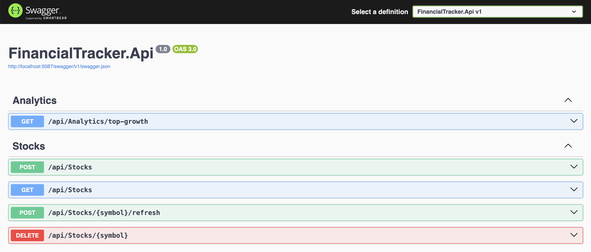

# Financial Data Tracker

A .NET Web API project that tracks stock prices from an external financial API, stores snapshots in a local database, and exposes analytics endpoints for internal monitoring use cases.

## Project Purpose

This project simulates a simple internal finance tool where users can:

- maintain a stock watchlist,
- fetch live quote data from an external provider,
- persist historical snapshots,
- and view ranked growth analytics from stored data.

## Tech Stack

- Backend: ASP.NET Core Web API
- Database: SQLite + Entity Framework Core
- External API: Finnhub
- API Documentation: Swagger / OpenAPI
- Testing: xUnit

## Why Finnhub and SQLite?

- Finnhub provides free stock quote access with an easy REST interface.
- SQLite keeps setup lightweight and requires no separate DB server.

## Architecture and Structure

The solution separates concerns into clear layers:

- `FinancialTracker.Api/Controller/` - HTTP endpoints only (`StocksController`, `AnalyticsController`)
- `FinancialTracker.Api/Services/` - business logic and orchestration
- `FinancialTracker.Api/Repositories/` - data access layer
- `FinancialTracker.Api/Clients/` - external API integration (`FinnhubApiClient`)
- `FinancialTracker.Api/Models/` - core entities (`Stock`, `PriceSnapshot`)
- `FinancialTracker.Api/DTOs/` - API request/response contracts
- `FinancialTracker.Api/Middleware/` - global exception handling
- `FinancialTracker.Api/Data/` - EF Core `AppDbContext`

## Design Pattern Used

### Repository Pattern

The project uses the Repository Pattern in the repository layer to abstract EF Core access from service logic.

Why this was chosen:

- keeps business rules out of controllers and persistence details out of services,
- improves testability (repositories can be mocked),
- supports cleaner, maintainable architecture.

Inline explanation is included in `FinancialTracker.Api/Repositories/StockRepository.cs`.

## Core Domain

- `Stock`: tracked symbol, company name, created timestamp
- `PriceSnapshot`: current price, previous close, fetched timestamp, linked to a stock

Relationship: one stock has many price snapshots.

## REST API Endpoints

Base URL depends on your local launch profile (example: `http://localhost:5087`).

### Stocks

- `POST /api/Stocks` - add a stock symbol and fetch/store initial quote
- `GET /api/Stocks` - list tracked stocks with latest snapshot
- `POST /api/Stocks/{symbol}/refresh` - fetch and store a fresh snapshot
- `DELETE /api/Stocks/{symbol}` - remove stock and related snapshots

### Analytics

- `GET /api/Analytics/top-growth?n=5` - return top N stocks ranked by growth percentage

## Analytical Use Case

Top growth is calculated from latest quote values:

`((CurrentPrice - PreviousClose) / PreviousClose) * 100`

This provides a practical aggregation view for identifying short-term outperformers.

## Error Handling

Global exception middleware returns JSON error payloads and prevents raw exception leakage.

Current implementation returns:

- `500 Internal Server Error` with `{ "error": "Unexpected server error." }` for unhandled exceptions

Recommended extension (for stronger evaluation):

- map validation errors to `400`,
- missing resources to `404`,
- external API failures to `502`.

## Setup and Run

### 1) Prerequisites

- .NET SDK (6+; current project targets `net10.0`)
- (Optional) EF CLI tool:

```bash
dotnet tool install --global dotnet-ef
```

### 2) Restore dependencies

```bash
dotnet restore
```

### 3) Configure Finnhub API key

Set your API key in:

- `FinancialTracker.Api/appsettings.Development.json` (preferred), or
- `FinancialTracker.Api/appsettings.json`

Expected config shape:

```json
{
  "Finnhub": {
    "ApiKey": "YOUR_FINNHUB_API_KEY"
  }
}
```

Get a free key at [finnhub.io](https://finnhub.io).

### 4) Apply database migration

```bash
dotnet ef database update --project FinancialTracker.Api --startup-project FinancialTracker.Api
```

### 5) Run API

```bash
dotnet run --project FinancialTracker.Api
```

Open Swagger using the active local port:

- `http://localhost:<port>/swagger`
- or `https://localhost:<port>/swagger`

Use the terminal line `Now listening on ...` to confirm exact URL.

## Docker Support

The project includes:

- `FinancialTracker.Api/Dockerfile`
- `platform.docker-compose.yml`

### Run with a single command

From repository root, run:

```bash
FINNHUB_API_KEY=your_key_here docker compose -f platform.docker-compose.yml up --build
```

Or create a `.env` file in repository root and run without inline variable:

```env
FINNHUB_API_KEY=your_key_here
```

```bash
docker compose -f platform.docker-compose.yml up --build
```

API will be available at:

- `http://localhost:8080/swagger`

### Stop containers

```bash
docker compose -f platform.docker-compose.yml down
```

### Notes

- SQLite database file is persisted via Docker volume `financialtracker_data`.
- Compose injects:
  - `Finnhub__ApiKey` from `FINNHUB_API_KEY`
  - `ConnectionStrings__DefaultConnection=Data Source=/app/data/financialtracker.db`

## Demo

This is a quick end-to-end flow you can run in Swagger UI.


### 1) Add a stock

Request: `POST /api/Stocks`

```json
{
  "symbol": "AAPL"
}
```

Expected: `201 Created`

### 2) List stocks

Request: `GET /api/Stocks`

Expected: `200 OK` with tracked stocks and latest snapshot values.

### 3) Refresh one stock

Request: `POST /api/Stocks/AAPL/refresh`

Expected: `204 No Content` and a newly stored snapshot.

### 4) Run analytics

Request: `GET /api/Analytics/top-growth?n=5`

Expected: `200 OK` with top-growing stocks.

Sample response:

```json
[
  {
    "symbol": "ICE",
    "currentPrice": 156.21,
    "previousClose": 156.3,
    "growthPercent": -0.06
  },
  {
    "symbol": "AAPL",
    "currentPrice": 270.17,
    "previousClose": 270.71,
    "growthPercent": -0.2
  },
  {
    "symbol": "TSLA",
    "currentPrice": 372.82,
    "previousClose": 376.02,
    "growthPercent": -0.85
  },
  {
    "symbol": "TW",
    "currentPrice": 116.18,
    "previousClose": 118.12,
    "growthPercent": -1.64
  },
  {
    "symbol": "NVDA",
    "currentPrice": 205.41,
    "previousClose": 209.25,
    "growthPercent": -1.84
  }
]
```

## Build and Test

Build:

```bash
dotnet build
```

If you add tests:

```bash
dotnet test
```

## Notes and Limitations

- Artificial intelligence tools were used in the project.
- I added Docker support, but I couldn’t test it because Docker crashed on my computer; I ran the program locally.
